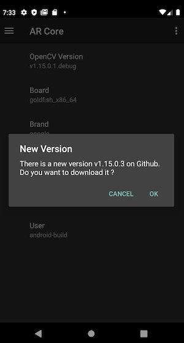

[](https://jitpack.io/#hannesa2/githubAppUpdate)

# An Android Library to update app with added apk in release 




This library provides an easy way to update app with added apk in release.

## Common usage

1. Extends from `AppCompatActivity` and import `coroutineScope`

  ```java
  import androidx.appcompat.app.AppCompatActivity
  import androidx.lifecycle.coroutineScope
  
  class MainActivity : AppCompatActivity() {
    
  }
  ```

2. Display the change log dialog by putting the following code in your activity's `onCreate()` method:

  ```java
  AppUpdateHelper.checkForNewVersion(this, 
    BuildConfig.GIT_USER, 
    BuildConfig.GIT_REPOSITORY, 
    lifecycle.coroutineScope
  )
  ```
  
3. And you need repository info eg in `build.config`
  
    ```groovy
    defaultConfig {
      ...
      versionCode getGitCommitCount()
    
      buildConfigField "String", 'GIT_USER', "\"" + getGitUser() + "\""
      buildConfigField "String", 'GIT_REPOSITORY', "\"" + getGitRepository() + "\""
    }
    
    static def getGitCommitCount() {
      def process = "git rev-list HEAD --count".execute()
      return process.text.toInteger()
    }
    
    static def getGitOriginRemote() {
      def process = "git remote -v".execute()
      def values = process.text.toString().trim().split("\\r\\n|\\n|\\r")
    
      def found = values.find { it.startsWith("origin") && it.endsWith("(push)") }
      return found.replace("origin", "").replace("(push)", "").replace(".git", "").trim()
    }
    
    static def getGitUser() {
      def token = getGitOriginRemote().split("/")
      return token[3]
    }
    
    static def getGitRepository() {
      def token = getGitOriginRemote().split("/")
      return token[4]
    }
    ```

## Include the library

The easiest way to add `githubAppUpdate to your project is via Gradle. Just add the following lines to your `build.gradle`:

```groovy
dependencies {
    implementation 'com.github.hannesa2:githubAppUpdate:0.2'
}
```

To tell Gradle where to find the library, make sure `build.gradle` also contains this:

```groovy
allprojects {
    repositories {
        ...
        maven { url 'https://jitpack.io' }
    }
}
```

## License

    Copyright (C) 2019 hannesa2

    Licensed under the Apache License, Version 2.0 (the "License");
    you may not use this file except in compliance with the License.
    You may obtain a copy of the License at

       http://www.apache.org/licenses/LICENSE-2.0

    Unless required by applicable law or agreed to in writing, software
    distributed under the License is distributed on an "AS IS" BASIS,
    WITHOUT WARRANTIES OR CONDITIONS OF ANY KIND, either express or implied.
    See the License for the specific language governing permissions and
    limitations under the License.
